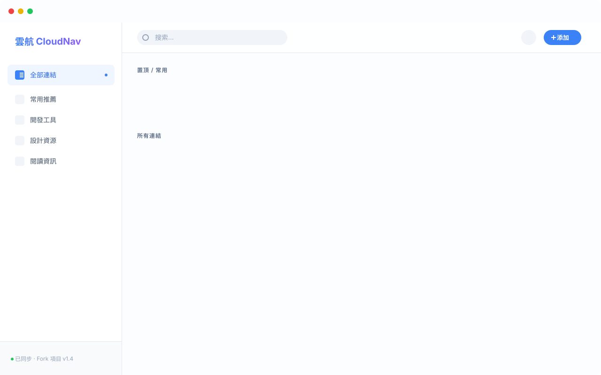
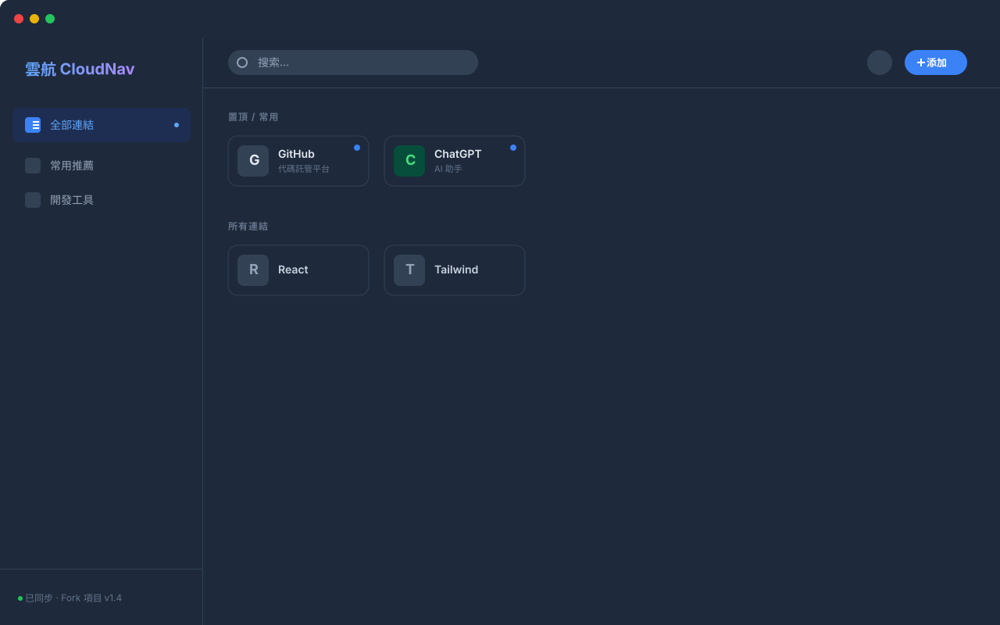
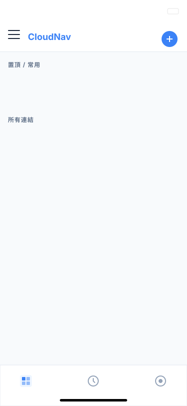

# CloudNav-abcd（修改版）
**本項目基於在大佬 https://github.com/sese972010/CloudNav- 的項目上，根據我的個性化需求做了一些修改，設置密碼後需要輸密訪問，適合個人使用！**

---
#### 最新版本v1.7.1 (2026.1.16 )
- 1、搜索框右側新增一鍵清空圖示
- 2、在分類目錄頁面搜索時新增顯示其他分類的內容
- 3、增加 jenboy 提交的github自動同步倉庫代碼

---

<strong>👉 點擊查看更新紀錄</strong>

#### 版本v1.7
- 1、同步更新設置頁面的界面和功能
- 2、同步升級瀏覽器擴展工具瀏覽器插件（功能提升）
- 3、新增帶有時間戳的WebDAV雙重備份功能
- 4、調整滑鼠懸浮和排序狀態下的站點卡片背景顏色
- 5、新增連結編輯頁面網址圖示即時預覽效果

#### 版本v1.6
- 1、站外搜索網站的設置保存到伺服器實現持久化
- 2、分類目錄權限部分修改：`常用推薦`分類調整為可以移動位置，修改和刪除存量分類需要再次輸入訪問密碼授權
- 3、默認訪問密碼一週過期，可以在左下角網站設置頁面修改過期時間

版本 v1.5.1:最佳化手機端訪問時，頂部選單欄搜索樣式和功能

#### 版本 v1.5
更新內容：
- 增加站外搜索功能，可以配置多個站外搜索網站，同時可以點擊搜索框左側的圖示彈出下拉框切換站外搜索網站

#### 版本V1.4
更新內容：
- 1、右鍵菜單：當將滑鼠移動到站點卡片後，可以點擊滑鼠右鍵調出右鍵菜單，右鍵菜單支持：複製連結、顯示二維碼、編輯連結、刪除連結等快捷操作。
- 2、增加簡約版和詳情版的站點卡片樣式切換

#### 版本V1.3
更新內容：

- 1、修復行動端訪問沒有退出按鈕
- 2、增加首次批次添加站點資訊不關窗口開關，增加效率
- 3、分類名稱旁增加該分類站點卡片數量
- 4、修復自訂網站名稱不被版本升級重設
- 5、站點圖示快取最佳化

#### 版本V1.2
更新內容：
- 1、解決站點卡片標題文字超出卡片邊框的問題
- 2、批次編輯增加全選功能
- 3、在某個分類下新增新連結自動默認歸屬到當前分類
- 4、添加新站點增加自動獲取網站圖示的功能
- 5、WebDAV備份增加InfiniCloud網路硬碟
- 6、增加退出功能，非私有電腦保護隱私
- 7、Chrome 擴展菜單改為中文

#### 版本V1.1
更新內容：
- `批次編輯`增加批次刪除和批次移動站點卡片
- 修復刪除分類目錄後沒有“常用推薦”的問題
- 添加新站點網址自動補全 https://

---
## 首次修改內容
#### 一、編輯連結增加自動獲取圖示功能
填寫網址後，點擊`自動獲取圖示`按鈕

#### 二、站點卡片支持拖拽排序

#### 三、導入導出增加 JSON 文件

#### 四、設置頁面增加修改網站名稱

#### 五、分類站點增加自訂圖示功能

---

# CloudNav (雲航) - 智慧私有導航站

 

<!-- 請將下方的連結替換為您實際部署後的 Cloudflare Pages 域名 -->

 

**一個現代化、基於 AI 輔助的全棧個人導航站。**
**無需購買伺服器，依託 Cloudflare 免費託管，實現多端數據即時同步。**

[在線示範](https://cloudnav.yy77.eu.org) • [功能特性](#-核心功能) • [項目展示](#-項目展示) • [部署教學](#-部署教學-免費) • [使用指南](#-使用指南)

---

<strong>👉 點擊查看項目功能介紹</strong>

## ✨ 核心功能

### 🧠 AI 深度集成
*   **多模型支持**: 完美支持 **Google Gemini**、**OpenAI**、**DeepSeek**、**Claude** 等任何相容 OpenAI 介面的模型。
*   **一鍵智慧補全**: 在設置面板一鍵掃描，自動為成百上千個書籤生成精準的中文簡介。
*   **智慧分類**: 添加連結時，AI 自動分析網頁內容並推薦最合適的分類目錄。

### ☁️ 數據同步與安全
*   **Cloudflare KV 同步**: 利用邊緣儲存技術，公司、家裡、手機三端數據秒級同步。
*   **WebDAV 雙重備份**: 支持堅果雲、Nextcloud 等 WebDAV 網路硬碟備份，數據自主掌控。
*   **隱私加密體系**:
    *   **全局鎖**: 部署時設置訪問密碼，防止他人查看。
    *   **目錄鎖**: 支持對“私有資源”等特定分類單獨設置密碼，隱藏敏感內容。

### 🎨 極致體驗
*   **Chrome 擴展插件**: 提供官方代碼生成，支持點擊瀏覽器圖示後**手動選擇分類**保存，體驗媲美原生。
*   **置頂專區**: 常用網站一鍵置頂，在首頁頂部常駐顯示。
*   **無縫遷移**: 支持導入 Chrome/Edge 書籤 HTML 文件（智慧去重）。

---

## 📸 項目展示

> 以下為 CloudNav 的實際運行界面預覽。

### 🖥️ 桌面端概覽
| 淺色模式 (Light Mode) | 深色模式 (Dark Mode) |
| :---: | :---: |
|  |  |
| *清爽明亮的日間視圖* | *護眼沉浸的夜間視圖* |

### 🛠️ 核心功能示範
| AI 智慧設置 | 分類加密鎖 | 行動端適配 |
| :---: | :---: | :---: |
|  |  |  |
| *一鍵批次生成描述* | *私密目錄密碼保護* | *完美適配手機瀏覽器* |

*(註：上方使用了項目生成的 SVG 向量預覽圖，代表實際 UI 布局)*

---

## 🚀 部署教學 (免費)

本應用完全基於 **Cloudflare Pages** + **KV** 構建，無需伺服器，永久免費。

> **📥 [點擊下載完整圖文教學 (.docx)](圖文教學.docx)**

### 📋 簡明部署步驟 (適合有經驗用戶)

1.  **Fork 項目**: 點擊右上角 Fork 按鈕，將本項目複製到您的 GitHub 帳號。
2.  **創建 Pages 應用**: 登錄 Cloudflare Dashboard -> Workers & Pages -> 創建應用程式 -> Pages -> 連接到 Git -> 選擇 `CloudNav-abcd`
3.  **配置構建**:
    *   框架預設: **無 (None)**
    *   構建命令: `npm run build`
    *   輸出目錄: `dist`
4.  **創建資料庫**: 在 Workers & Pages -> KV 中創建一個新的命名空間，命名為 `CLOUDNAV_DB`
5.  **綁定變數**:
    *   進入 Pages 項目設置 -> 綁定 (Bindings) -> 添加 KV 命名空間 -> 變數名填 `CLOUDNAV_KV`，值選擇剛才創建的 `CLOUDNAV_DB`
    *   進入 環境變數 (Environment variables) -> 添加變數 `PASSWORD`，值為您的訪問密碼。
6.  **部署**: 重新部署項目即可。

---

<strong>👉 點擊查看部署方法（圖文教學）</strong>

### 📖 保姆級圖文教學 (適合新手)

> 如果您是第一次使用 Cloudflare，請嚴格按照以下步驟操作。

#### 第一步：點擊創建應用程式

#### 第二步：點擊右下角 Get started

#### 第三步：導入現有你已經 fork 的倉庫

#### 第四步：這裡選你自己 fork 的倉庫名稱

#### 第五步：按圖中填寫，其他默認

#### 第六步：左側找到 Workers KV 點擊右側新建

#### 第七步：空間名稱填寫 `CLOUDNAV_DB`（建議複製）

#### 第八步：綁定 KV 資料庫
回到剛才的 pages 設置頁面找到綁定-右側下滑找到 kv 命名空間，變數名稱填寫 `CLOUDNAV_KV`（建議複製）

#### 第九步：設置訪問密碼
設置中找到變數和機密-填入 `PASSWORD`（建議複製）下面的值填入你自己要設置的密碼，這一步是你登入導航頁需要的登入密碼

#### 第十步：添加自訂域名（可選項）

**🎉 所有設置結束後，請務必到部署頁面點擊“重新部署” (Create New Deployment)，項目即可正常使用！**

---

<strong>👉 點擊查看使用指南</strong>

## ⚙️ 使用指南

### 1. Chrome 擴展程序 (推薦)
點擊側邊欄左下角的 **“設置”** -> **“擴展工具”**。
系統會自動根據您的域名生成 3 個文件代碼 (`manifest.json`, `popup.html`, `popup.js`)。
1. 在電腦新建文件夾，保存這 3 個文件。
2. 打開 Chrome 擴展管理頁 (`chrome://extensions`)。
3. 開啟右上角 **“開發者模式”**。
4. 點擊 **“載入已解壓的擴展程序”**，選擇剛才的文件夾。
5. 以後瀏覽網頁時，點擊插件圖示即可彈出窗口，**選擇分類並保存**。

### 2. 配置 AI 服務
點擊側邊欄底部的 **“設置”** -> **“AI 設置”**：
*   **提供商**: Google Gemini 或 OpenAI 相容 (DeepSeek等)。
*   **Key & Model**: 輸入 API Key 和模型名稱。
*   **一鍵補全**: 點擊底部的 **“一鍵補全所有描述”**，AI 將自動掃描所有無描述的連結並後台生成。

### 3. WebDAV 備份
點擊側邊欄的 **“備份”** 圖示，配置 WebDAV 資訊 (如堅果雲)，即可一鍵上傳備份到雲端。

### 4. 本地數據導出 (Local Data Export)
點擊側邊欄的 **“備份”** 圖示 -> **“導出 HTML”**。
*   生成的 HTML 文件完全相容 **Chrome**、**Edge**、**Firefox** 等主流瀏覽器的導入格式。
*   完整保留您在雲航中整理的分類目錄結構。

**如何導入到瀏覽器 (以 Chrome 為例):**
1. 打開 Chrome 瀏覽器，點擊右上角菜單 -> **書籤與清單** -> **書籤管理器**。
2. 點擊頁面右上角的三個點圖示 -> **導入書籤**。
3. 選擇剛才從雲航下載的 HTML 文件即可恢復所有書籤。

---

**如果您覺得項目不錯，希望給本項目點一個免費的 Star ⭐️，感謝您的關注！**

**如果有 Bug 或改進的地方，請在 Issue 中提交您的建議。**

 

Made with ❤️ by CloudNav Team

